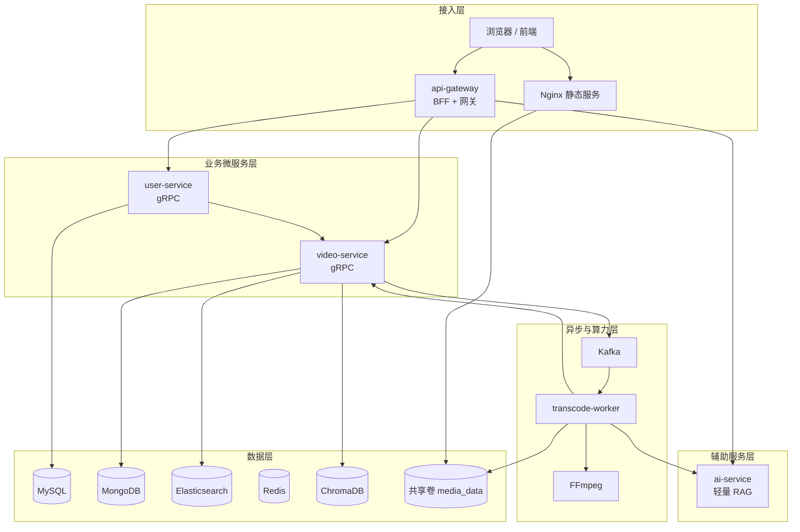
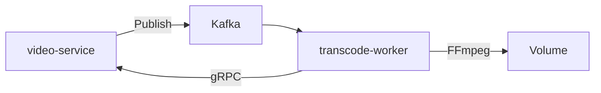

# 短视频平台后端架构与模块详解（完整版）

> 本文档全面、详细地讲解 `short-video-platform` 项目的后端整体架构，以及**微服务框架**、**转码模块**、**AI模块**的实现细节与设计思路。

---

## 一、整体架构全景

### 1.1 架构定位

本项目采用 **BFF + 微服务 + 事件驱动 + 轻量 AI** 的混合架构，核心目标是：

- 实现“上传 → 双阶段审核 → 异步转码 → 发布”完整闭环
- 保持服务边界清晰，同时避免过度拆分
- 支持 Feed 个性化推荐 + 轻量 RAG 问答

### 1.2 完整架构图



### 1.3 服务角色划分

| 层级 | 服务 | 角色 | 是否业务微服务 |
|------|------|------|----------------|
| 接入层 | `api-gateway` | BFF、协议转换、鉴权、限流 | 否 |
| 业务微服务层 | `user-service`、`video-service` | 核心业务逻辑 | **是** |
| 异步处理层 | `transcode-worker` | 转码异步处理 | 否 |
| 辅助服务层 | `ai-service` | 轻量 RAG + 标签 | 否 |

**核心结论**：**真正的业务微服务只有 2 个**。

---

## 二、微服务框架详解

### 2.1 微服务框架整体设计

本项目采用**克制且清晰的微服务拆分**，只拆了 2 个业务微服务：

- `user-service`：用户域
- `video-service`：视频域（最复杂）

这种拆分方式符合 **DDD（领域驱动设计）** 中的“限界上下文”思想：
- 用户和视频是两个相对独立的业务域
- 视频域内部状态流转复杂，适合独立管理

### 2.2 api-gateway（BFF 网关）

**定位**：不是业务微服务，而是**接入层 + BFF**。

**核心职责**：
- 对外提供 REST API
- JWT 解析与角色注入
- 文件上传与路径安全校验
- 媒体文件访问控制（源片鉴权、转码文件公开）
- 限流（Redis）
- 协议转换（HTTP → gRPC）

**关键设计**：
- 所有 gRPC 调用自动携带 `x-internal-key`，防止外网直连微服务
- 上传路径必须满足 `uploads/u{userId}/...` 规则

### 2.3 user-service

**定位**：用户与认证中心。

**存储**：MySQL

**主要功能**：
- 注册、登录、OAuth
- JWT 签发（含 role）
- 角色管理（user / reviewer / admin）
- 作为 BFF 代理查询用户视频列表

**安全策略**：
- 几乎所有接口都需要 `INTERNAL_GRPC_KEY`
- 管理员接口额外需要 admin 角色

### 2.4 video-service（最核心的业务微服务）

**定位**：视频全生命周期管理 + 互动 + 推荐 + 搜索。

**存储**：
- MongoDB（主存储）
- Elasticsearch（搜索）
- ChromaDB（RAG 向量化）

**核心子模块**：

#### 2.4.1 视频状态机模块

这是整个系统的**心脏**。

状态流转：
```
pending_source_review → transcoding → pending_final_review → ready
```

关键方法：
- `Create`：初始状态为 `pending_source_review`
- `ApproveSourceReview`：CAS + 发 Kafka
- `UpdateTranscodeResult`：仅允许 `pending_final_review` / `failed`
- `ApprovePublishReview`：改 `ready` + 触发 ES/Chroma 索引

**设计亮点**：
- 使用 `UpdateStatusIf` 实现 CAS，防止重复发转码任务
- 转码回调不能直接发布，必须再走人工审核

#### 2.4.2 发布面隔离模块

所有公开访问的接口都会调用 `requirePublished`，确保只有 `ready` 状态的视频可见。

#### 2.4.3 推荐与个性化模块

- 支持基于标签权重的个性化推荐
- 点赞 +2、收藏 +3 更新用户偏好
- 内存排序 + 新片加权

#### 2.4.4 鉴权规则

定义了五类权限：
- Public
- Internal（Worker 专用）
- RequireJWT
- RequireReviewer
- RequireAdmin

---

## 三、转码模块详解

### 3.1 模块定位与必要性

转码模块是**异步解耦**的典型案例。

**为什么必须独立**：
- FFmpeg 是 CPU 密集型任务
- 需要支持多码率输出
- 转码时间长，不能阻塞 API
- 需要失败重试机制

### 3.2 转码模块架构



### 3.3 关键设计

#### 3.3.1 Kafka 消息设计

```go
type TranscodeTask struct {
    VideoID     string
    SourcePath  string
    Title       string
    Description string
}
```

- 使用 `video_id` 作为分区键
- 消息体自包含，Worker 无需回查数据库

#### 3.3.2 Worker 实现要点

- 使用 `consumerGroupHandler` + 信号量控制并发
- 转码失败时**不提交 offset**，实现自动重试
- 成功后调用 `UpdateTranscodeResult`，状态只能变为 `pending_final_review`

#### 3.3.3 FFmpeg 转码流程

1. 路径安全校验
2. ffprobe 获取时长
3. 提取封面（第 1 秒）
4. 输出 720p + 1080p HLS

**输出目录结构**：

```
transcoded/{videoId}/
├── cover.jpg
├── 720p/index.m3u8
└── 1080p/index.m3u8
```

### 3.4 失败与重试机制

- 失败不提交 Kafka offset
- 目前无死信队列（生产建议增加）
- 转码回调有状态校验，防止非法状态转换

---

## 四、AI 模块详解

### 4.1 模块定位

AI 模块目前采用**轻量 RAG 方案**，主要服务于两个场景：

1. 转码后自动打标签
2. Feed 页面针对推荐视频的智能问答

### 4.2 技术选型

- **ChromaDB**：持久化向量数据库
- **轻量 embedding**：Chroma 内置 embedding（无需 torch）
- **无 LLM**：目前使用模板拼接

### 4.3 核心流程

#### 4.3.1 向量化索引流程

视频发布审核通过后，video-service 自动调用：

```
POST /videos/index
{
  "video_id": "...",
  "title": "...",
  "description": "...",
  "tags": [...]
}
```

存入结构：
- Document：`title + description + tags`
- Metadata：`video_id`、`title`、`tags`

#### 4.3.2 RAG 查询流程（Feed 上下文）

前端提问时会携带当前 Feed 的视频 ID 列表：

```json
{
  "question": "...",
  "context_video_ids": ["v4", "v8", "v12"]
}
```

ai-service 查询时加上 `where` 过滤，实现**只在推荐视频中检索**。

### 4.4 为什么选择轻量方案？

重方案（torch + LLM）的问题：
- 构建极慢（500MB+ torch）
- 启动需要下载大模型
- 资源占用高

轻量方案优势：
- 构建快、启动快
- 保留向量检索能力
- 支持 Feed 上下文限制
- 适合教学演示

---

## 五、各模块协作关系总结

| 协作场景 | 涉及模块 | 通信方式 |
|----------|----------|----------|
| 用户注册登录 | Browser → GW → US | REST + gRPC |
| 视频上传 | Browser → GW → VS | REST + gRPC |
| 源片审核通过 | GW → VS → Kafka | gRPC + Kafka |
| 转码完成回调 | TW → VS | gRPC（Internal） |
| 发布审核通过 | VS → ES + Chroma | 内部调用 |
| Feed 推荐 | Browser → GW → VS | REST + gRPC |
| AI 问答 | Browser → GW → AI | REST + HTTP |
| 转码后打标签 | TW → AI | HTTP |

---

## 六、总结

### 6.1 架构亮点

- 清晰的 2 个业务微服务拆分
- 完善的状态机与发布隔离
- 合理的异步转码解耦
- 轻量且实用的 AI 设计

### 6.2 演进方向

未来如果要做成大型平台，可考虑继续拆分：
- `interaction-service`
- `recommend-service`
- `search-service`

---

**相关文档**：

- [后端代码架构与编写指南.md](./后端代码架构与编写指南.md)
- [面经-短视频平台.md](./面经-短视频平台.md)
- [能力对照评估.md](./能力对照评估.md)