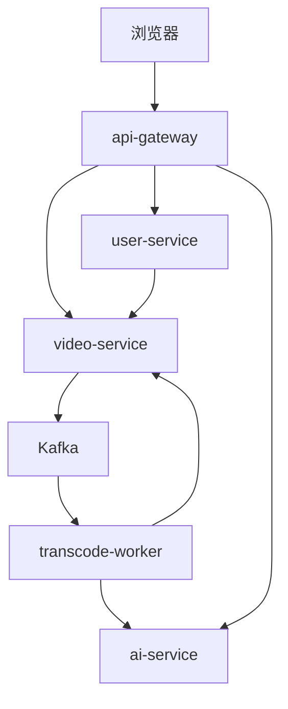
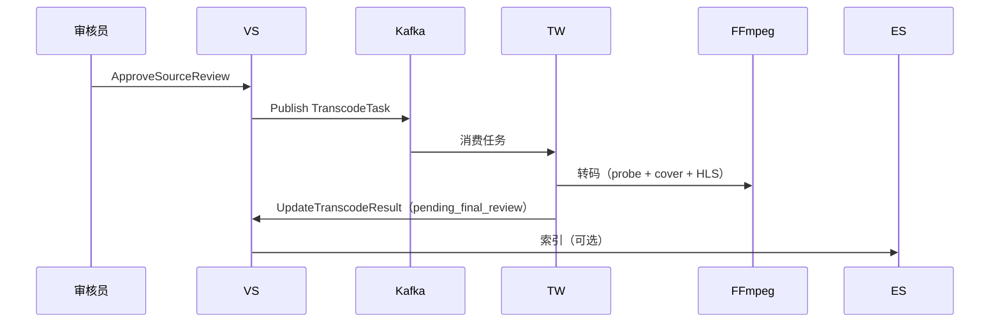

# 短视频平台后端代码架构与编写指南（详细版）

> 本文档针对 `short-video-platform` 项目后端进行系统性整理，重点讲解**微服务模块**、**转码模块**和**AI模块**的实现细节与设计思路。

---

## 一、整体架构概览

本项目后端采用 **BFF + 微服务 + 事件驱动** 的混合架构，核心思想是：

- **对外暴露 REST**（浏览器友好）
- **对内使用 gRPC**（性能与类型安全）
- **重任务异步化**（转码通过 Kafka 解耦）
- **状态机驱动业务**（视频审核发布流程清晰）



---

## 二、微服务模块详解

微服务模块是整个后端的核心，包含 `api-gateway`、`user-service` 和 `video-service` 三个服务。

### 2.1 api-gateway（网关层）

**定位**：唯一的 HTTP 入口，承担 BFF（Backend for Frontend）职责。

**主要功能**：

- 路由转发与协议转换（HTTP → gRPC）
- JWT 鉴权与角色校验
- 文件上传与落盘（`uploads/u{userId}/...`）
- 媒体文件访问控制（源片需鉴权，转码文件公开）
- 限流（Redis 固定窗口）

**关键代码位置**：

- `api-gateway/internal/router/router.go`：路由定义
- `api-gateway/internal/handler/handler.go`：上传、Feed、搜索等接口
- `api-gateway/internal/middleware/jwt.go`：JWT 中间件
- `api-gateway/internal/handler/phase4.go`：AI 问答代理

**设计亮点**：

- 所有 gRPC 调用都会自动带 `x-internal-key`，防止外网直接访问微服务
- 上传路径安全校验（`ValidateSourcePathForUser`）

---

### 2.2 user-service（用户域）

**定位**：负责用户账号体系和角色管理。

**存储**：MySQL（`users` 表）

**主要接口**（gRPC）：

- `Register` / `Login`：注册登录
- `OAuthLogin`：GitHub / Mock OAuth
- `GetUserInfo` / `GetUserVideos`：用户信息与视频列表
- `ListUsers` / `SetUserRole`：管理员操作

**安全设计**：

- 几乎所有接口都需要 `INTERNAL_GRPC_KEY`
- `UpdateAvatar` 需要 JWT
- `ListUsers` / `SetUserRole` 需要 admin 角色

**代码分层**：

```
handler/grpc_server.go
  ↓
service/user_service.go（bcrypt 密码 + JWT 签发）
  ↓
repository/mysql.go
```

---

### 2.3 video-service（视频域，最核心）

**定位**：视频元数据、状态机、互动、推荐、搜索等全部业务逻辑。

**存储**：

- MongoDB：视频、点赞、评论、弹幕、偏好、审计日志
- Elasticsearch：`ready` 视频的全文搜索
- Kafka：发布转码任务

**核心功能模块**：

#### 2.3.1 视频状态机

定义在 `internal/model/video.go`：

```go
StatusPendingSourceReview → transcoding → pending_final_review → ready
```

**关键方法**：

- `Create`：创建视频，状态为 `pending_source_review`
- `ApproveSourceReview`：CAS 更新状态 + 发 Kafka
- `UpdateTranscodeResult`：Worker 回调，只能改 `pending_final_review` 或 `failed`
- `ApprovePublishReview`：改 `ready` + ES 索引 + Chroma 索引

#### 2.3.2 发布面隔离

所有公开接口都会调用 `requirePublished`：

```go
func (s *VideoService) requirePublished(ctx context.Context, videoID string) (*model.Video, error)
```

只有 `ready` 状态的视频才能：

- 出现在 Feed / 搜索
- 被点赞、评论、弹幕
- 被公开获取详情

#### 2.3.3 推荐 Feed 实现

位于 `recommend_service.go`：

- 如果用户有标签权重：拉最多 100 条 `ready` 视频 → 按权重 + 新片加分 + 随机排序
- 否则：按时间倒序
- 点赞 +2 / 收藏 +3 更新用户偏好

#### 2.3.4 鉴权规则

定义在 `pkg/auth/grpc_server.go`：

```go
Public          // GetVideoList、SearchVideos、GetRecommendedFeed 等
Internal        // UpdateTranscodeResult（仅 Worker）
RequireJWT      // CreateVideo、ToggleLike、PostComment 等
RequireReviewer // 源片审核、发布审核
RequireAdmin    // 管理后台操作
```

---

## 三、转码模块详解

转码模块是本项目中**最典型的异步解耦案例**。

### 3.1 为什么需要转码模块？

- 转码是 CPU 密集型任务（FFmpeg），不能阻塞 API
- 需要支持多清晰度输出（720p / 1080p）
- 需要自动提取封面和时长
- 需要在转码完成后更新数据库状态

### 3.2 整体流程



### 3.3 关键组件

#### 3.3.1 Kafka 消息定义（`pkg/events/transcode.go`）

```go
type TranscodeTask struct {
    VideoID     string
    UserID      string
    SourcePath  string   // uploads/u{userId}/.../source.mp4
    Title       string
    Description string
}
```

**设计要点**：
- 分区键使用 `video_id`，保证同一视频的任务有序
- 消息体包含完整信息，Worker 不需要再查库

#### 3.3.2 transcode-worker 实现

**入口**：`transcode-worker/cmd/main.go`

**核心逻辑**（`internal/worker/worker.go`）：

```go
func (w *Worker) handleMessage(...) error {
    // 1. 解析任务
    // 2. 调用 FFmpeg 转码
    result, err := w.transcoder.Transcode(ctx, task.VideoID, task.SourcePath)
    if err != nil {
        // 失败时更新状态为 failed，但不 MarkMessage（允许重试）
        return err
    }
    // 3. 成功后更新状态为 pending_final_review + play_urls
    w.videoClient.UpdateTranscodeResult(...)
}
```

**并发控制**：

使用信号量限制同时转码数量：

```go
sem := make(chan struct{}, w.limit) // TRANSCODE_CONCURRENCY
```

#### 3.3.3 FFmpeg 转码实现（`internal/ffmpeg/transcoder.go`）

**主要步骤**：

1. **路径安全校验**：防止 `..` 穿越目录
2. **ffprobe 获取时长**
3. **提取封面**（第 1 秒帧）
4. **多清晰度转 HLS**：
   - 720p + 1080p
   - H.264 + AAC
   - 4 秒分片
   - veryfast 预设

**输出结构**：

```
transcoded/{videoId}/
├── cover.jpg
├── 720p/index.m3u8
└── 1080p/index.m3u8
```

### 3.4 失败处理与重试

- 转码失败时：更新状态为 `failed`，但**不提交 Kafka offset**
- 消息会重新被消费，实现自动重试
- 目前没有死信队列（DLQ），生产环境建议增加

### 3.5 与 video-service 的交互

- Worker 通过 **INTERNAL_GRPC_KEY** 调用 `UpdateTranscodeResult`
- video-service 会校验当前状态必须是 `transcoding`
- 转码回调**不能**直接把状态改成 `ready`，必须再走发布审核

---

## 四、AI 模块详解

AI 模块是本项目中**最轻量但最灵活**的部分，目前采用 ChromaDB + 轻量 RAG 方案。

### 4.1 为什么需要 AI 模块？

- 转码完成后自动打标签（提升搜索体验）
- 在 Feed 页面提供针对推荐视频的智能问答
- 作为未来接入 LLM 的预留接口

### 4.2 当前轻量方案设计

**技术选型**：

- **ChromaDB**：持久化向量数据库
- **轻量 embedding**：Chroma 内置 embedding（无需 torch）
- **无 LLM**：目前使用模板拼接回答

**核心接口**：

| 接口 | 说明 | 调用方 |
|------|------|--------|
| `POST /videos/index` | 向量化存储视频 | video-service（发布审核通过时） |
| `POST /rag/ask` | 语义检索 + 回答 | api-gateway（前端 Feed 页面） |
| `POST /tags/generate` | 关键词打标签 | transcode-worker（向后兼容） |

### 4.3 向量化存储流程

当视频变为 `ready` 状态时：

```go
// video-service
s.indexVideoToAI(ctx, v)  // 调用 ai-service /videos/index
```

ai-service 会把以下内容存入 Chroma：

- **Document**：`title + description + tags`
- **Metadata**：`video_id`、`title`、`tags`
- **ID**：`video_id`

### 4.4 RAG 查询流程（Feed 上下文）

前端在 Feed 页面提问时，会把当前已加载的视频 ID 列表作为 `context_video_ids` 传给后端：

```json
{
  "question": "Go 并发入门 这期视频讲了什么？",
  "context_video_ids": ["v4", "v8", "v12"]
}
```

ai-service 在查询 Chroma 时会加上 `where` 过滤：

```python
where_filter = {"video_id": {"$in": context_video_ids}}
results = collection.query(query_texts=[q], where=where_filter, ...)
```

这样就实现了**只在用户当前看到的推荐视频中进行语义检索**。

### 4.5 与 Feed 的集成

前端改动主要在 `FeedView.vue`：

- 新增浮动按钮 “AI 问答”
- 聊天面板发送问题时自动带上 `getCurrentFeedVideoIDs()`
- 使用 `askAI(question, contextVideoIDs)` 接口

### 4.6 为什么选择轻量方案？

重方案（torch + sentence-transformers + LLM）的问题：

- 构建极慢（532MB torch）
- 启动需要下载大模型
- 容器资源占用高
- 教学项目维护成本过高

轻量方案的优势：

- 构建快、启动快
- 完全去掉 torch 依赖
- 保留了 Chroma 的向量检索能力
- 支持 Feed 上下文限制
- 足够演示“个性化 RAG”的概念

---

## 五、总结

### 5.1 三个核心模块对比

| 模块 | 核心技术 | 复杂度 | 关键设计 |
|------|----------|--------|----------|
| **微服务** | Gin + gRPC + Mongo + ES | 中 | 状态机 + 发布隔离 + 分层鉴权 |
| **转码** | Kafka + FFmpeg | 中 | 异步解耦 + CAS 防重复 + 失败重试 |
| **AI** | ChromaDB（轻量） | 低 | Feed 上下文限制 + 语义检索 |

### 5.2 架构亮点

- 清晰的状态机与发布面隔离
- 合理的异步解耦（Kafka）
- 轻量但可扩展的 AI 设计
- 统一的分层鉴权机制

---

**相关文档**：

- [后端架构与流程说明.md](./后端架构与流程说明.md)
- [面经-短视频平台.md](./面经-短视频平台.md)
- [能力对照评估.md](./能力对照评估.md)