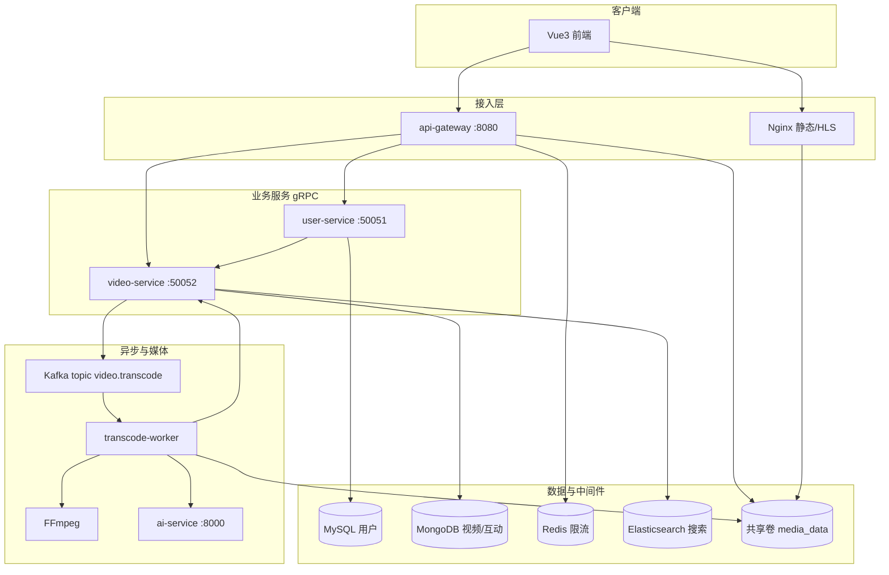
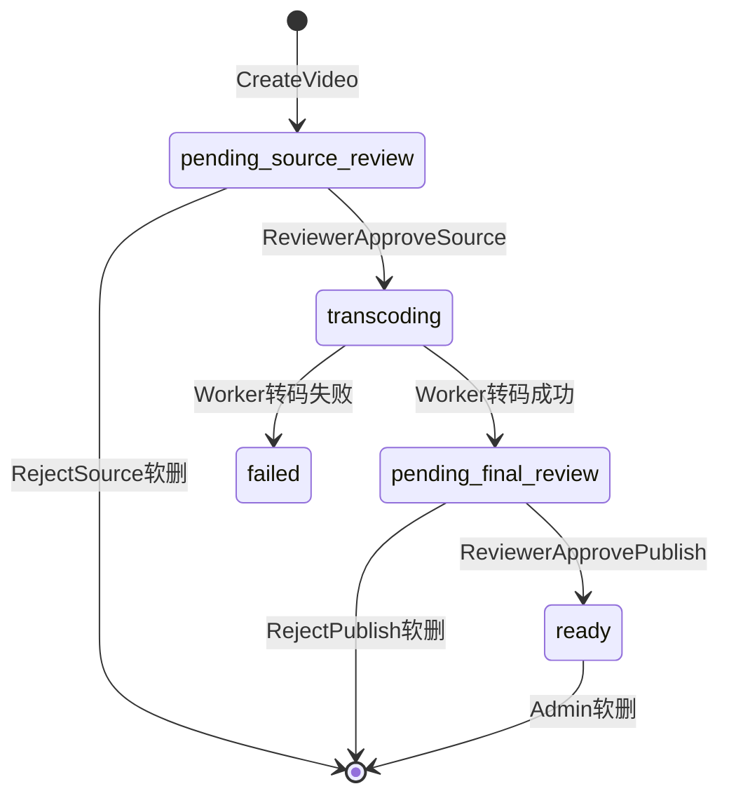
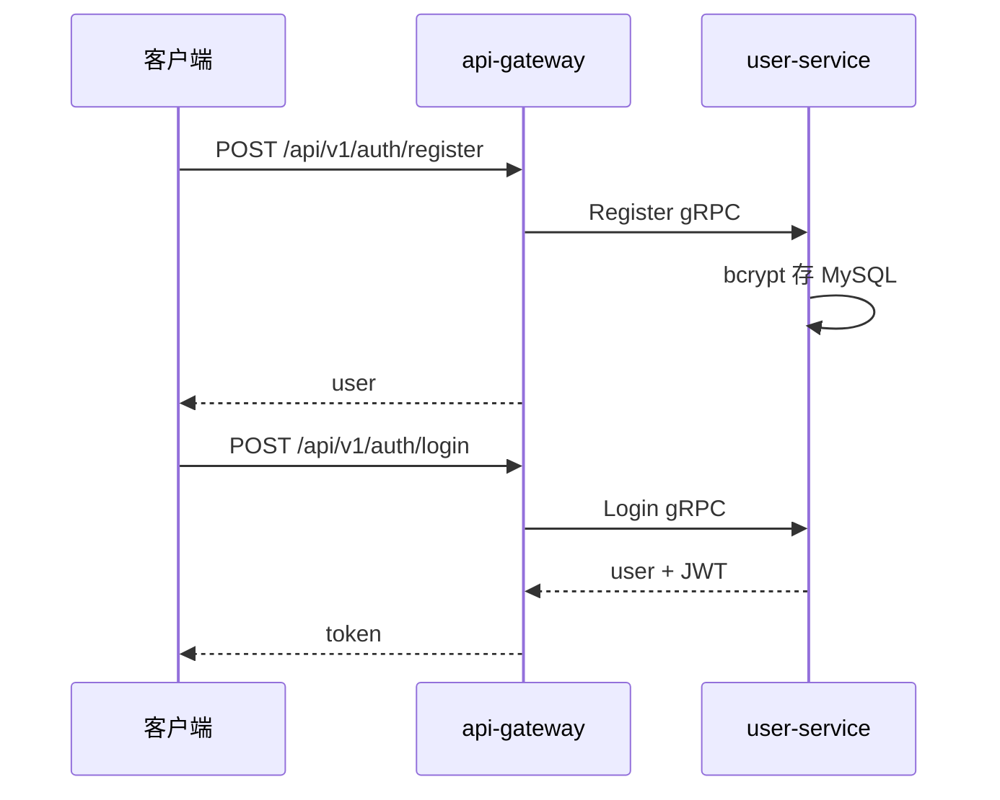
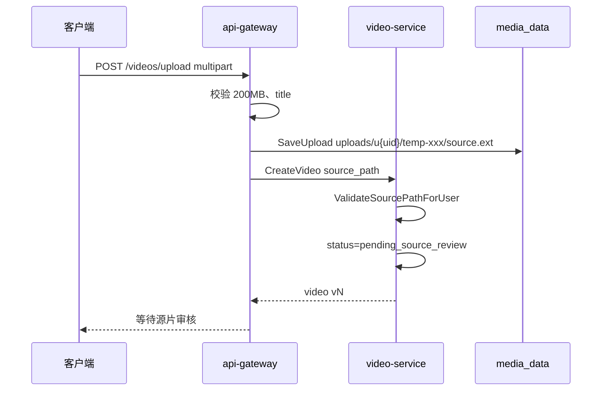
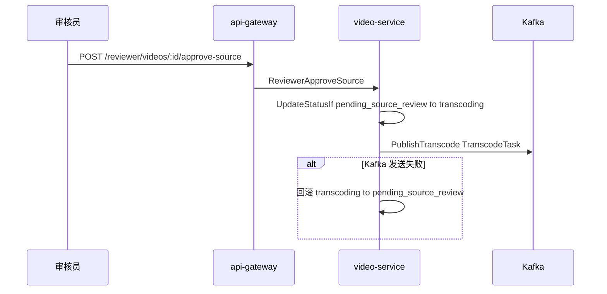
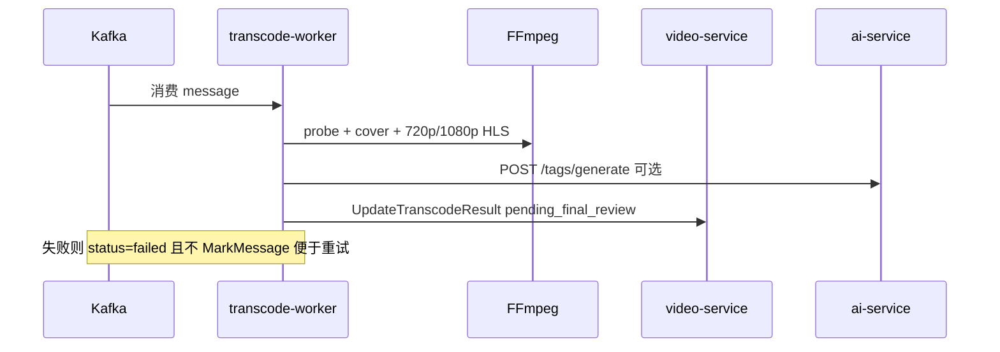
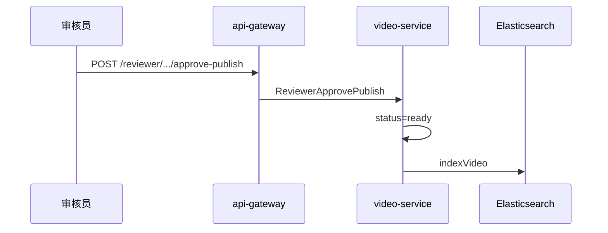
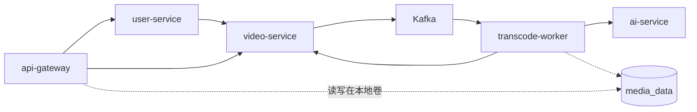

# 短视频平台 — 后端架构与流程说明

本文档说明 `short-video-platform` **后端**的模块划分、数据存储、核心业务流程，以及各服务之间的调用关系。面向阅读代码或答辩讲解时使用。

---

## 1. 总体架构

系统采用 **BFF + 微服务 + 异步 Worker** 形态：浏览器只访问 **api-gateway**（HTTP），网关通过 **gRPC** 调用 **user-service**、**video-service**；转码由独立的 **transcode-worker** 消费 Kafka，再回调 video-service。



| 组件 | 技术 | 职责 |
|------|------|------|
| **api-gateway** | Gin | HTTP API、文件上传落盘、媒体文件访问、JWT 校验、限流 |
| **user-service** | gRPC + GORM | 注册登录、OAuth、用户资料、角色；聚合查询用户视频列表 |
| **video-service** | gRPC + Mongo | 视频 CRUD、审核状态机、互动、推荐、搜索索引、发 Kafka |
| **transcode-worker** | Kafka Consumer | 读源片、FFmpeg 转 HLS、回写转码结果、可选 AI 打标签 |
| **ai-service** | FastAPI | 关键词标签、`/rag/ask`（非内容安全审核） |

**共享代码：** `proto/` 定义契约，`gen/` 为生成代码，`pkg/auth` 统一 JWT 与 gRPC 鉴权，`pkg/events` 定义 Kafka 消息体。

---

## 2. 仓库目录（后端相关）

```
short-video-platform/
├── api-gateway/          # HTTP 入口
│   ├── cmd/main.go
│   └── internal/
│       ├── router/router.go      # 路由与中间件
│       ├── handler/              # HTTP 处理器
│       ├── middleware/           # JWT、限流、角色
│       ├── storage/upload.go     # 本地文件写入
│       └── grpcclient/           # 连接 user/video gRPC
├── user-service/         # 用户域
│   ├── cmd/main.go
│   └── internal/{handler,service,repository,database}/
├── video-service/        # 视频域（核心）
│   ├── cmd/main.go
│   └── internal/
│       ├── handler/grpc_server.go
│       ├── service/              # 业务逻辑
│       ├── repository/           # Mongo 访问
│       ├── kafka/producer.go
│       ├── search/               # Elasticsearch
│       └── database/mongo.go
├── transcode-worker/
│   ├── cmd/main.go
│   └── internal/{worker,ffmpeg,aitag,grpcclient}/
├── pkg/
│   ├── auth/             # JWT、gRPC 拦截器、路径校验
│   ├── events/           # TranscodeTask
│   ├── redislimit/       # 网关限流
│   └── objectstore/      # MinIO 抽象（未接入主路径）
├── proto/video.proto
├── gen/videopb, gen/userpb
└── docker-compose.yml    # 一键编排
```

---

## 3. 数据存储分工

### 3.1 MySQL（user-service）

- **库名：** `short_video`（与 Mongo 同名，物理隔离）
- **表：** `users`（id、username、password_hash、nickname、avatar、role、oauth 字段等）
- **角色：** `user` | `reviewer` | `admin`（JWT `role` 声明 + 网关/ gRPC 校验）

### 3.2 MongoDB（video-service）

| 集合 | 用途 |
|------|------|
| `videos` | 视频元数据、状态、`source_path`、`play_urls`、`tags`、软删字段 |
| `likes` / `favorites` | 用户与视频关系，`(video_id, user_id)` 唯一索引防重复 |
| `comments` | 评论 |
| `video_stats` | 点赞/评论/收藏计数（与互动写同事务更新） |
| `barrages` | 弹幕 |
| `user_preferences` | 用户标签权重（推荐用） |
| `audit_logs` | 管理/审核操作审计 |
| `video_archives` | 永久删除前归档快照 |

**videos 索引（启动时创建）：**

- `video_id` 唯一
- `user_id + created_at`
- `status + created_at`

视频 ID 规则：`v1`、`v2`… 由 `NextVideoID` 扫描已有 `video_id` 递增生成。

### 3.3 Elasticsearch

- 索引 `ready` 状态视频的标题、描述、标签
- `SearchVideos`：先 ES 查 id，再 Mongo 补全并过滤非 `ready`
- 发布审核通过、`ApprovePublish` 后 `indexVideo`

### 3.4 Redis

- **仅 api-gateway** 用于按 IP 固定窗口限流（`REDIS_ADDR` 未配置或 ping 失败则**不限流**）

### 3.5 本地媒体卷 `media_data`

- Gateway 与 transcode-worker **共享** `/data/media`（Compose volume）
- 路径约定：
  - 源片：`uploads/u{userId}/{uploadId}/source.mp4`
  - 转码产物：`transcoded/{videoId}/cover.jpg`、`720p/index.m3u8`、`1080p/index.m3u8`

---

## 4. 视频状态机（核心域模型）

定义见 `video-service/internal/model/video.go`：

| 状态 | 常量 | 含义 |
|------|------|------|
| 待源片审核 | `pending_source_review` | 上传完成，等待审核员看原片 |
| 转码中 | `transcoding` | 源片已通过，Kafka 任务已发出 |
| 待发布审核 | `pending_final_review` | 转码成功，有 `play_urls`，待精审 |
| 已发布 | `ready` | 可在 Feed/搜索/互动中对外展示 |
| 失败 | `failed` | 转码失败 |
| （历史） | `pending` | 常量保留，新上传不走此状态 |



**可见性规则（重要）：**

- `List` / `GetRecommendedFeed` / `Search`：只面向 **`ready`** 且未软删的视频
- `GetPublicByID`：`ready` 对所有人可见；非 `ready` 仅**作者本人**可见（审核预览）
- 点赞、评论、弹幕、收藏：`requirePublished` → 必须 `ready`
- 用户主页：看别人只显示 `ready`；看自己显示全部状态（含审核中）

**转码回调不能直达 `ready`：** `UpdateTranscodeResult` 若传 `ready` 会直接报错，必须走发布审核。

---

## 5. 核心业务流程

### 5.1 用户注册与登录



- JWT 由 `pkg/auth` 签发，Claims 含 `user_id`、`username`、`role`
- 后续请求：`Authorization: Bearer <token>`
- Gateway `handler.ctx()` 把 token 放进 context；gRPC 客户端拦截器附带 `x-internal-key` + Bearer（见 `pkg/auth/metadata.go`）

**user-service 安全模型：** 几乎所有 RPC 要求 **internal key**（仅网关可调用）；`UpdateAvatar` 额外要 JWT；`ListUsers` / `SetUserRole` 要 **admin**。

---

### 5.2 视频上传与建单



**关键代码：**

- 上传：`api-gateway/internal/handler/handler.go` → `UploadVideo`
- 落盘：`api-gateway/internal/storage/upload.go` → `SaveUpload`
- 建单：`video-service/internal/service/video_service.go` → `Create`

**注意：** 上传**不会**触发 Kafka；必须人工「源片通过」后才进转码队列。

---

### 5.3 双阶段审核 + 转码

#### 阶段 A：源片审核



`TranscodeTask` 字段（`pkg/events/transcode.go`）：`video_id`、`user_id`、`source_path`、`title`、`description`。

#### 阶段 B：Worker 转码



- 并发：`TRANSCODE_CONCURRENCY` 信号量限制同时转码数
- 鉴权：Worker 调 `UpdateTranscodeResult` 使用 **INTERNAL_GRPC_KEY**（`pkg/auth` Internal 规则）
- 产物 URL 形如：`/media/transcoded/{videoId}/720p/index.m3u8`

#### 阶段 C：发布审核



驳回（源片或发布）：走 `SoftDeleteVideo` → 进回收站（`deleted_at`、`purge_at` 约 30 天）。

---

### 5.4 播放与媒体访问

| 资源类型 | HTTP 路径 | 权限 |
|----------|-----------|------|
| 源片 | `GET /api/v1/media/uploads/*` | JWT + 本人或 reviewer/admin |
| 转码 HLS/封面 | `GET /media/transcoded/*` | **公开**（网关或 Nginx 直出） |
| 头像 | `GET /media/avatars/*` | 公开 |

生产环境 Nginx 与 Gateway **共用** `media_data`；Nginx 配置会 **禁止** 直接访问 `/media/uploads/`，迫使源片走鉴权 API。

---

### 5.5 Feed 推荐

**入口：** `GET /api/v1/videos/feed` → `GetRecommendedFeed`（OptionalJWT 可带 `viewer_user_id`）

**逻辑**（`recommend_service.go`）：

1. 若登录且 `user_preferences` 有标签权重：
   - 从 Mongo 拉最多 **100** 条 `ready` 候选
   - 按标签权重 + 7 日内新片加分 + 随机扰动排序
   - 内存分页返回，`personalized=true`
2. 否则：按 `created_at` 倒序的普通 `List`

**偏好更新：** 点赞 ±2、收藏 ±3 时 `trackPreference` 累加对应视频 tags 权重（无播放时长埋点）。

---

### 5.6 互动（点赞 / 收藏 / 评论 / 弹幕）

统一前置：`requirePublished(video_id)`。

| 操作 | gRPC | 存储 |
|------|------|------|
| 点赞切换 | `ToggleLike` | `likes` + `video_stats.like_count` |
| 收藏切换 | `ToggleFavorite` | `favorites` + stats |
| 发评论 | `PostComment` | `comments` + stats |
| 弹幕 | `PostBarrage` / `ListBarrages` | `barrages` |

点赞/收藏对 `(video_id, user_id)` 有 **唯一索引**，从存储层避免重复点赞记录。

---

### 5.7 搜索

`GET /api/v1/videos/search?q=` → `SearchVideos`：

1. Elasticsearch 全文检索得 `video_id` 列表
2. Mongo 按 id 取详情，丢弃非 `ready`
3. ES 不可用时 gRPC 返回 `Unavailable`

---

### 5.8 管理后台

| HTTP 前缀 | 角色 | 能力 |
|-----------|------|------|
| `/api/v1/admin/*` | admin | 用户列表、改角色、视频列表、软删/恢复/永久删、回收站、审计日志 |
| `/api/v1/reviewer/*` | reviewer 或 admin | 待审列表、源片/发布 通过驳回 |

审核操作会写 `audit_logs`（如 `video.source_approve`、`video.publish_approve`）。

---

## 6. api-gateway 层详解

### 6.1 路由分组（`router/router.go`）

- **无版本前缀：** `/api/health`、`/media/*`、受保护 `/api/v1/media/uploads/*`
- **`/api/v1`：** 全局 `RateLimit()` 中间件
- **公开：** 注册登录、搜索、视频列表、Feed（可选登录）、视频详情
- **需 JWT：** 上传、点赞、评论、弹幕、个人喜欢/收藏列表
- **admin / reviewer 子路由：** JWT + `RequireRole`

### 6.2 Handler 职责拆分

| 文件 | 内容 |
|------|------|
| `handler.go` | 用户、视频 CRUD、Feed、搜索、上传 |
| `admin.go` | 管理端、审核端 HTTP 封装 |
| `media.go` | 源片鉴权下载、转码静态文件 |
| `phase4.go` | `POST /ai/ask` 代理到 ai-service |
| `context.go` | 从 Gin 提取 Bearer 注入 gRPC context |

### 6.3 与下游通信

`grpcclient`  dial user/video 时使用 `auth.UnaryClientInterceptor()`，每次出站自动带：

- `x-internal-key: INTERNAL_GRPC_KEY`
- `authorization: Bearer <token>`（若 HTTP 请求有）

---

## 7. video-service 层详解

### 7.1 分层结构

```
gRPC VideoGRPCServer (handler/grpc_server.go)
        ↓
VideoService (service/*.go)
        ↓
Repository 接口 (repository/repository.go)
        ↓
MongoRepository / BarrageRepository / InteractionRepository / ...
```

`VideoService` 聚合依赖：

- `repo`：视频主表
- `barrageRepo`、`interactRepo`：弹幕与互动
- `auditRepo`、`archiveRepo`：审计与归档
- `prefRepo`：推荐权重
- `producer`：Kafka
- `search`：ES 客户端

### 7.2 gRPC 鉴权表（`pkg/auth/grpc_server.go`）

| 类型 | 示例 RPC | 要求 |
|------|----------|------|
| Public | `GetVideoList`、`GetRecommendedFeed`、`SearchVideos` | 无 JWT |
| Internal | `UpdateTranscodeResult` | 仅 internal key |
| RequireJWT | `CreateVideo`、`ToggleLike`、`PostComment` | 有效 JWT |
| RequireReviewer | `ReviewerApproveSource` 等 | JWT + reviewer/admin |
| RequireAdmin | `AdminSoftDeleteVideo` 等 | JWT + admin |

Handler 内从 context 取 `auth.UserIDFromContext(ctx)`，并校验 `CreateVideo` 的 `user_id` 与 token 一致，防止替他人上传。

### 7.3 启动流程（`video-service/cmd/main.go`）

1. 连接 Mongo、创建索引
2. `SeedVideos`（库空时插入 v1–v3 演示数据）
3. 连接 Kafka Producer
4. 连接 ES、`BackfillTags`、`ReindexSearch`（仅 `ready`）
5. 注册 gRPC + `UnaryServerInterceptor`

---

## 8. user-service 层详解

- **注册/登录：** bcrypt 密码，JWT 含 role
- **OAuth：** GitHub / Mock 回调，按 provider+oauth_id 绑定或新建用户
- **GetUserVideos：** 作为 BFF 代理，带 viewer 信息调 video-service `ListVideosByUser`（本人看全状态，他人只看已发布）
- **ListUsers / SetUserRole：** 仅 admin

依赖 **video-service 已启动**（Compose 中 `depends_on: video-service`）。

---

## 9. transcode-worker 层详解

| 模块 | 作用 |
|------|------|
| `worker.Run` | Kafka ConsumerGroup，topic `video.transcode` |
| `handleMessage` | 解析 JSON → FFmpeg → gRPC 回写 |
| `ffmpeg.Transcoder` | ffprobe 时长、截封面、H.264+AAC 输出 HLS |
| `aitag.Client` | 调 ai-service 合并标签 |

**失败策略：** 打日志、`UpdateTranscodeResult(status=failed)`，**不** `session.MarkMessage`，消息可再次被消费（需注意重复转码时的目录覆盖）。

---

## 10. 服务间依赖关系小结



| 调用方 | 被调用方 | 场景 |
|--------|----------|------|
| 浏览器 | api-gateway | 全部 REST |
| api-gateway | user-service | 账号、用户页视频列表入口 |
| api-gateway | video-service | 视频、互动、审核、搜索 |
| user-service | video-service | 用户主页视频 |
| video-service | Kafka | 源片审核通过后发转码任务 |
| transcode-worker | video-service | 转码结果回写 |
| transcode-worker | ai-service | 标签（非审核） |
| api-gateway | ai-service | RAG 问答代理 |

**无循环：** video-service 不回调 user-service；转码与上传解耦靠 Kafka。

---

## 11. 关键环境变量

| 变量 | 使用方 | 说明 |
|------|--------|------|
| `JWT_SECRET` | auth 包 | 签发/校验 JWT |
| `INTERNAL_GRPC_KEY` | 全部 gRPC | 网关→微服务、worker→video |
| `MONGODB_URI` / `MONGODB_DATABASE` | video-service | |
| `MYSQL_*` | user-service | |
| `KAFKA_BROKERS` / `KAFKA_TRANSCODE_TOPIC` | video-service、worker | 默认 `video.transcode` |
| `ELASTICSEARCH_URL` / `ELASTICSEARCH_INDEX` | video-service | 可空则禁用搜索 |
| `REDIS_ADDR` | api-gateway | 限流，可选 |
| `MEDIA_ROOT` | gateway、worker | 默认 `./data/media` |
| `TRANSCODE_CONCURRENCY` | worker | 默认 2 |
| `AI_SERVICE_URL` | worker、gateway | 标签 / RAG |

---

## 12. 与「能力对照评估」的对应关系

本项目的**后端强项**集中在：

1. 清晰的 **视频状态机** 与双阶段审核  
2. **Kafka 异步转码** 与 API 解耦  
3. **gRPC 分层鉴权**（public / JWT / internal / 角色）  
4. **发布面隔离**（`ready` 才能互动与推荐）  
5. Mongo 索引与点赞唯一约束  

**尚未在后端实现**的典型生产能力：分片上传、对象存储主路径、AI 内容安全、Redis 业务缓存、签名 URL、互动异步队列、分库分表、Prometheus 等（详见同目录 `能力对照评估.md`）。

---

## 13. 本地阅读代码的建议顺序

1. `proto/video.proto` — 理解 RPC 面  
2. `video-service/internal/model/video.go` — 状态常量  
3. `review_service.go` + `video_service.go`（Create / UpdateTranscodeResult）  
4. `transcode-worker/internal/worker/worker.go`  
5. `api-gateway/internal/router/router.go` + `handler/handler.go`（UploadVideo）  
6. `pkg/auth/grpc_server.go` + `metadata.go`  
7. `recommend_service.go`、`repository/interaction.go`  

按此顺序阅读，可以从「一条视频的一生」串起绝大部分后端逻辑。
