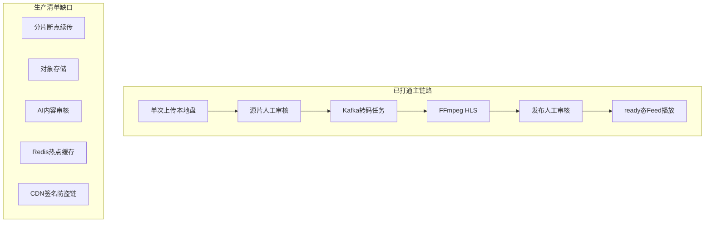

# 短视频平台能力对照评估

**评估对象：** `week08/homework/short-video-platform`  
**评估日期：** 2026-05-29  
**定位：** 教学/作业向全栈 MVP（Vue3 + Gin Gateway + gRPC 微服务 + Mongo/MySQL + Kafka + FFmpeg Worker + Docker Compose），**不是**生产级短视频平台。

**图例：** ✅ 已实现 · 🟡 部分实现 · ❌ 未实现

---

## 总览（按大类）

| 大类 | 覆盖度 | 一句话 |
|------|--------|--------|
| 一、上传与存储 | 🟡 ~25% | 单次 multipart + 本地盘；无分片/秒传/OSS |
| 二、转码 | 🟡 ~55% | Kafka 异步 + 720p/1080p HLS + 封面；无 480p/MP4/水印 |
| 三、内容审核 | 🟡 ~35% | 人工双阶段完整；无 AI 涉黄暴恐等 |
| 四、接口与性能 | 🟡 ~40% | 分页/限流/ES 搜索有；无热点 Redis 缓存、无 200ms SLA |
| 五、推荐与首页流 | 🟡 ~45% | 标签权重 + 新片加权；无埋点体系/高 QPS 设计 |
| 六、数据库设计 | 🟡 ~50% | 单库 + 索引合理；无分库分表/游标分页 |
| 七、高并发写 | 🟡 ~30% | 点赞唯一索引；同步写、无互动队列 |
| 八、播放体验 | 🟡 ~50% | HLS 多清晰度 + 本地进度；无 CDN/ABR/真预加载 |
| 九、安全 | 🟡 ~55% | JWT/gRPC 鉴权/上传路径；无签名 URL/防盗链 |
| 十、合规与法律 | ❌ ~5% | 基本无 |
| 十一、运维监控 | 🟡 ~15% | 健康检查 + Compose；无指标/告警/熔断 |

---

## 一、视频上传与存储（最核心）

| 能力 | 状态 | 代码依据 |
|------|------|----------|
| 大文件分片上传 / 断点续传 | ❌ | 单次 `FormFile`：`api-gateway/internal/handler/handler.go`；`web/src/views/UploadView.vue` 整文件 FormData |
| 上传进度条 | ❌ | 仅 `loading` 布尔，无 `onUploadProgress`/分片进度 |
| 秒传（MD5 去重） | ❌ | 无 hash 字段、无 dedup 逻辑 |
| 上传重试机制 | 🟡 | 用户可手动再传；无自动断点重试 |
| 限制可执行文件 | 🟡 | 头像有扩展名白名单；视频后端无 MIME/魔数校验（`api-gateway/internal/storage/upload.go`） |
| 校验真实类型（不看后缀） | ❌ | 前端 `video/*`；转码前才 `ffprobe`（`transcode-worker/internal/ffmpeg/transcoder.go`） |
| 单文件大小上限 | ✅ | 200MB：`handler.go`、`web/nginx.conf` |
| 云存储 OSS/S3 | ❌（运行路径） | 实际上传 `os.Create` 写本地 `MEDIA_ROOT`；`pkg/objectstore/store.go` 有 MinIO 抽象但未接入 upload/transcode 主路径 |
| Compose 里的 MinIO | 🟡 | `docker-compose.yml` 起了 MinIO，Gateway 配了 `MINIO_*`，业务仍走共享卷 `media_data` |
| 上传路径安全 | ✅ | `uploads/u{userId}/...` + `pkg/auth/pathutil.go` |

---

## 二、视频转码（必做）

| 能力 | 状态 | 代码依据 |
|------|------|----------|
| 多清晰度 | 🟡 | 仅 720p + 1080p HLS（`transcode-worker/internal/ffmpeg/transcoder.go`）；无 480p |
| 统一 MP4 + H.264 | 🟡 | 编码为 H.264+AAC，输出为 HLS m3u8，无渐进 MP4 播放地址 |
| 封面截取 | ✅ | 第 1 秒帧 `cover.jpg` |
| 异步队列 | ✅ | 源片审核通过后 Kafka → `transcode-worker/internal/worker/worker.go`；失败不 MarkMessage 可重投 |
| 不阻塞前端 | ✅ | 上传后立即返回；转码在 worker |
| 水印 / 裁剪 / 压缩策略 | ❌ | FFmpeg 无 overlay/drawtext；仅 scale + veryfast |
| 转码结果写库 | ✅ | `pending_final_review` + `play_urls`（`video-service/internal/service/video_service.go` FSM） |

---

## 三、内容审核（法律红线）

| 能力 | 状态 | 代码依据 |
|------|------|----------|
| 先审后转 / 先审后发 | ✅ | `pending_source_review` → `transcoding` → `pending_final_review` → `ready`：`review_service.go`、`web/src/views/ReviewerView.vue` |
| AI 涉黄暴恐涉政等 | ❌ | `ai-service/app.py` 仅关键词打标签 + RAG 问答，无 moderation API |
| 视频帧 / 语音 / 全模态审核 | ❌ | 无 |
| 标题话题评论 AI 审核 | ❌ | 评论/弹幕同步入库，无机审 |
| 违规拦截下架限流 | 🟡 | 人工驳回 → 软删除/回收站；无限流策略引擎 |
| 转码后 AI 标签 | 🟡 | Worker 调 `/tags/generate`（关键词），非内容安全 |

---

## 四、接口与性能（用户体验关键）

| 能力 | 状态 | 代码依据 |
|------|------|----------|
| 列表 < 200ms | ❌（未保证） | 无 SLA/压测；推荐池最多拉 100 条内存排序（`recommend_service.go`） |
| 分页滚动加载 | ✅ | `page`/`page_size` offset；Feed/Home 前端分页 |
| 主键游标分页 | ❌ | 全是 skip/limit（`video-service/internal/repository/mongo.go`） |
| Redis 缓存热点 | ❌ | Redis 仅可选 IP 限流（`api-gateway/internal/middleware/ratelimit.go`） |
| 限流 | 🟡 | Redis 固定窗口；Redis 不可用则不限流 |
| 防重复提交 | ❌ | 无幂等键 |
| 全文搜索 | ✅ | Elasticsearch `SearchVideos` |

---

## 五、推荐算法与首页流

| 能力 | 状态 | 代码依据 |
|------|------|----------|
| 推荐池 | 🟡 | `ListReadyActive` + 标签权重 + 7 天内新片加分 + 随机扰动 |
| 新视频流量扶持 | 🟡 | `ageDays < 7` 加分，非独立冷启动池 |
| 热门加权 | ❌ | 无播放量/热度榜加权 |
| 兴趣标签 | 🟡 | 点赞 ±2、收藏 ±3（`trackPreference`） |
| 数据埋点齐全 | ❌ | 无播放完成率、停留时长、转发埋点 |
| 高 QPS Feed | ❌ | 无预计算 Feed、无缓存、无压测 |

---

## 六、数据库设计

| 能力 | 状态 | 代码依据 |
|------|------|----------|
| 分库分表 | ❌ | 单 Mongo + 单 MySQL |
| 必要索引 | ✅ | `video_id` 唯一、`user_id+created_at`、`status+created_at`；点赞/收藏唯一索引 |
| 避免 SELECT * | 🟡 | 多数 Find 全文档 |
| 列表避免大 JOIN | ✅ | Mongo 分集合；用户 MySQL、视频 Mongo |
| 深分页问题 | 🟡 | offset 深页会变慢，未用 cursor |

---

## 七、高并发场景

| 能力 | 状态 | 代码依据 |
|------|------|----------|
| 点赞/评论异步写队列 | ❌ | 同步写 Mongo |
| 防重复点赞 | ✅ | `(video_id, user_id)` 唯一索引 + Toggle |
| 乐观锁 | ❌ | 转码 CAS 有；互动无 version |
| 服务无状态 | ✅ | 多容器可水平扩 |
| 互动防刷 | 🟡 | 点赞有唯一约束；评论/弹幕无业务防刷 |

---

## 八、播放体验

| 能力 | 状态 | 代码依据 |
|------|------|----------|
| 上下滑预加载 | 🟡 | `shouldRenderPlayer` 当前 ±1 条挂载 HLS（`FeedView.vue`） |
| 秒开 / 首帧优化 | 🟡 | HLS.js + 封面 |
| CDN | ❌ | Nginx 静态 alias |
| 自适应码率 ABR | 🟡 | 前端手动切换清晰度；非 master playlist 自动 ABR |
| 播放进度记录 | ✅ | `localStorage`（`playbackMemory.js`） |

---

## 九、安全问题

| 能力 | 状态 | 代码依据 |
|------|------|----------|
| 签名 URL / 时效链接 | ❌ | 转码资源公开 `/media/transcoded/*` |
| 防盗链 | 🟡 | 源片需 JWT+ACL；HLS 可直链 |
| XSS/SQL 注入 | 🟡 | ORM/驱动参数化；前端无系统消毒 |
| 鉴权防篡改状态 | ✅ | gRPC 方法级规则；转码回调不能直达 `ready` |
| 角色权限 | ✅ | user/reviewer/admin |

---

## 十、合规与法律

| 能力 | 状态 |
|------|------|
| 实名认证 | ❌ |
| 用户协议 / 隐私政策 | ❌ |
| IP 定位 / 区域限制 | ❌ |
| 未成年人模式 | ❌ |

---

## 十一、运维与监控

| 能力 | 状态 | 代码依据 |
|------|------|----------|
| Docker Compose 一键部署 | ✅ | `docker-compose.yml` |
| HTTP `/health` | ✅ | Gateway |
| 日志 | 🟡 | 标准 log.Printf |
| Prometheus / 告警 / 熔断 | ❌ | 无 |
| 队列阻塞告警 | ❌ | 无 Kafka lag 监控 |
| 备份策略 | ❌ | 仅 Compose volume |

---

## 做得较好的能力（面试可讲）

1. 双阶段人工审核 + 状态机 + CAS 发 Kafka  
2. 转码与 API 解耦（Kafka + worker + gRPC 回写）  
3. 发布面隔离（仅 `ready` 进 Feed/搜索）  
4. 微服务鉴权骨架（JWT + internal key + 角色 RPC）  
5. 基础互动与推荐 MVP（点赞唯一索引、标签偏好、ES 搜索）  
6. 前端 Feed（竖滑、相邻预挂载播放器、HLS 清晰度、本地续播）

---

## 与生产清单差距 TOP 5

1. 分片上传 + 对象存储（OSS）  
2. AI 内容安全审核  
3. CDN + 签名防盗链  
4. Redis 热点缓存 + Feed 预计算  
5. 全链路埋点 + 运维可观测  

---

## 结论

**未做到完整生产级短视频平台**；作为 Week08 作业 MVP，**「上传 → 人工审 → 异步转码 → 再审 → 播放」主链路**闭环可演示。

粗算：**约 30% 已实现、约 25% 部分实现、约 45% 未实现**（合规与运维几乎空白）。

本报告为只读评估，不修改业务代码。后续补强建议顺序：对象存储+分片上传 → AI 机审 → 签名 URL/CDN → Redis Feed 缓存 → 埋点与监控。
